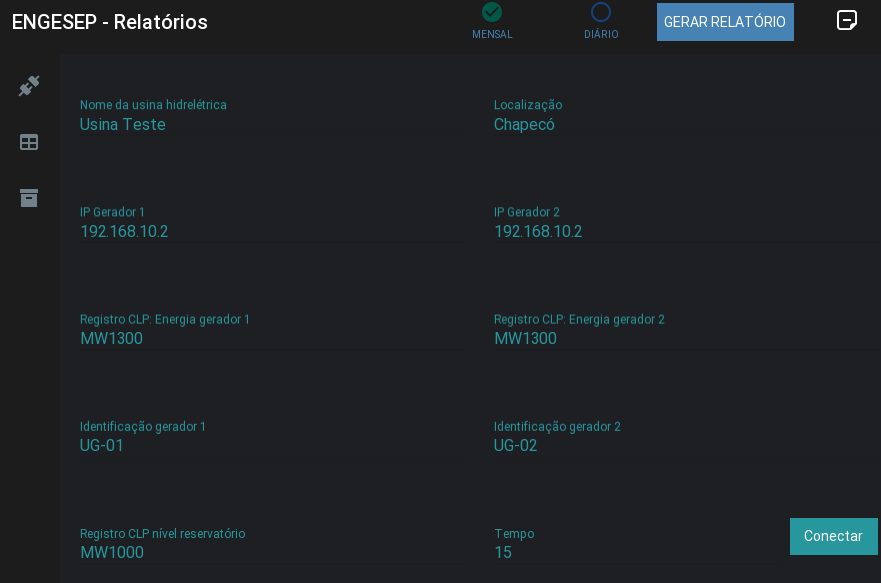
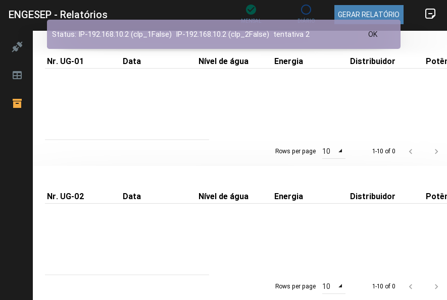
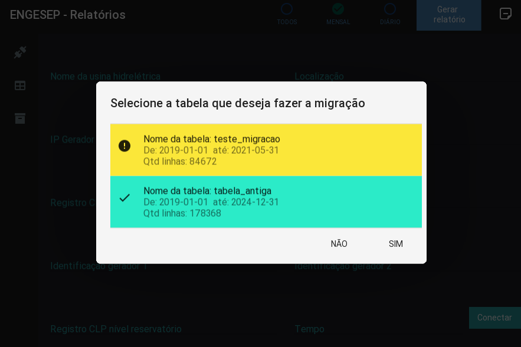

# EngeSEP
## Gerador de relatórios

Software com interface responsiva, que permite ao operador, configurar, visualizar e gerar relatórios. A partir de dados retirados diretamente dos registros do CLP da unidade geradora de energia.

### Requerimentos para instalação
```sh
   pip install
        kivy==2.0.0
        kivymd==0.104.2
        pandas==1.3.5
        fpdf2==2.4.6
        watchdog==2.1.6
        pyModbusTCP==0.1.10
        seaborn==0.11.2
        Unidecode==1.3.2
        asynckivy==0.5.2
        openpyxl==3.0.9
```
### Interface





### contato
jrmfilho37@gmail.com
whatsapp: 49-999771330