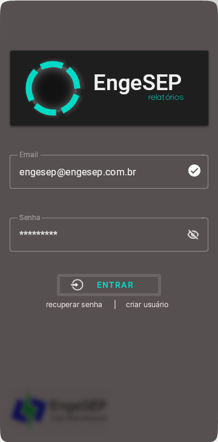

# EngeSEP

## Disposição dos arquivos

## Gerador de relatórios

Software com interface responsiva, que permite ao operador, configurar, visualizar e gerar relatórios. A partir de dados retirados diretamente dos registros do CLP da unidade geradora de energia.

### Requerimentos para instalação
```sh
   pip install
        kivy==2.0.0
        kivymd==0.104.2
        pandas==1.3.5
        fpdf2==2.4.6
        watchdog==2.1.6
        pyModbusTCP==0.1.10
        seaborn==0.11.2
        Unidecode==1.3.2
        asynckivy==0.5.2
        openpyxl==3.0.9
```
### Interface




### contato
jrmfilho37@gmail.com
whatsapp: 49-999771330
```sh
'''
	| Propósito da aplicação
	|------------------------
	| Gerar relatórios de geração de energia elétrica.
'''

'''
	| Requisitos
	|------------------------
	| Download de todos os dados em csv.
	| Gerar relatório por período em PDF.
'''

'''
	| Estrutura de software
	|------------------------
	| MVC.
'''

'''
	| Classes
	|------------------------
	| Main
	| Interface
	| Controller
	| CLP
	| Banco de dados
	| PDF
'''

'''
	| Funcionalidades das classes
	|------------------------
	| # Main
	|
	|	Instância o kivy, carrega a interface, executa o processo de inicialização.
	|
	| # Interface
	|
	| 	Possibilita o gerenciamento das comunicações, visualização de informações e opções de
	|	geração de relatório.
	|
	| # Controller
	|
	|	Mediador que estabelece uma politica de acesso, assim como a comunicação como o CLP e Banco |   de dados.
	|
	| # CLP
	|
	|	Instância do CLP, permite iniciar e fechar conexões, assim como a leitura de dados.
	|
	| # Banco de dados
	|
	|	Instância do Banco de dados, permite iniciar e fechar uma conexão singleton, assim como as |	operações com dados: propagação, leitura, escrita, apagar e migrar.
	|
	| # PDF
	|
	|	Instância que gera o PDF,
'''
'''
	| Políticas de acesso
	|------------------------
	| # Usuários
	|
	|	- Visitante
	|	- Investidor
	|	- Gerenciador
	|
	| # Primeira política
	|
	|	Para ter acesso as Screens: Dados e relatórios
	|
'''
'''
	| Funcionalidades ativas no modo [desenvolvimento, produção]
	|--------------------------------
	| # Modo de desenvolvimento
	|
	|	#> Reload de desenvolvimento
	|
	|	#> Controle de desempenho e uso de memória
	|
	|	#> Tratamento de Erros
	|
	|	#> Propagação de dados para teste
	|
	| # Modo de produção
'''
''' | Mapeamento dos processos
	|-----------------------------------
	| # Inicialização
	|
	|	#> classe main :: def on_star :: object inicializacao
	|		:: class ControllerDB :: def ge
	|
	| # Conectar
	|
	| # Gerar relatório
	|
    |
'''
'''
	| Lógica de processos no desenvolvimento
	|------------------------
	| #> app ligado
	|
	|	#>
	|
	| #> ScreenConnect on_press ButtonConectar
	|
	|	#> Todas as entradas foram preenchidas
	|		> Status: True
	|			route.Requisitons.connectar(ip)
	|		> Status: False
	|			rout
	|
	| #> ScreeReports on_press Butt
	|
'''
'''
	| Propriedades e Métodos das classes
	|-----------------------------------
	| # Interface
'''

'''
	| Estrutura de diretórios exemplo
	|------------------------
	| ./model
	|	.DB
	|	.CLP
	|	.PDF
	| ./controllers
	|	./observer
	|		.ObserverDB
	|	./exceptions
	|		.ExceptionsError
	|	./controller
	|		.ControllerUser
	|		.ControllerDB
	|		.ControllerCLP
	|	./providers
	|		.ProviderAccess
	| ./routes
	|	.Requisitions
	| ./assets
	|	./fonts
	|	./imagens
	| ./view
	| 	./widgets
	|		./login
	|			.cardlogin
	|			.input_email
	|			.input_senha
	|			.button_entrar
	|		./interface
	|			.menu
	|			.card_ug
	|			.menu_relatorio
	|		./config
				.menu
				.input_usina
				.input_localizacao
				.input_id
				.input_registro
				.button_addclp
				.button_conectar
	|	./layouts
	|		.login
	|		.interface
	|		.configuracao
	|	.CompositeView
	| .Main
	| .Setup
'''

''' | Interface widgets
	|--------------------------
	| Login
	|

```